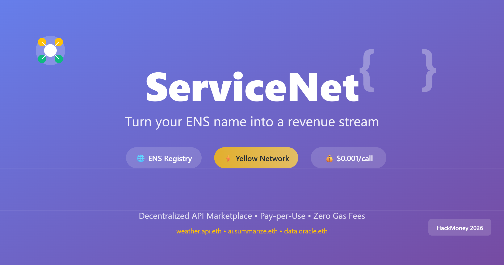

# ServiceNet

A decentralized marketplace where services are discovered via ENS names and consumed via instant, gas-free micropayments powered by Yellow state channels.

---

<p align="center">
  
</p>

<br/>

## 📦 Quick Start

### Prerequisites
- Node.js 18+
- npm or pnpm
- MetaMask wallet
- Sepolia testnet ETH

### Installation

```bash
# Clone repository
git clone <repo-url>
cd ServiceNet

# Install frontend
cd frontend
npm install

# Install backend
cd ../backend
npm run setup

# Install contracts (optional)
cd ../contracts
forge install
```

### Run Locally

**Frontend:**
```bash
cd frontend
npm run dev
# Visit http://localhost:3000
```

**Backend (Weather API):**
```bash
cd backend
npm run dev:weather
# API runs on http://localhost:3001
```

**Test Backend:**
```bash
cd backend
npm test
```

## 🏗️ Architecture

```
┌─────────────────────────────────────────────────────┐
│                  Frontend (Next.js)                  │
│  • Service Discovery  • Consumer Dashboard           │
│  • Provider Dashboard • Registration                 │
└──────────────┬───────────────────────┬───────────────┘
               │                       │
               ↓                       ↓
┌──────────────────────┐   ┌──────────────────────────┐
│  Smart Contracts     │   │  Backend Services        │
│  • ServiceNet        │   │  • Provider SDK          │
│  • YellowSession     │   │  • Weather API           │
│  • USDC              │   │  • Auth & Metering       │
└──────────────────────┘   └──────────────────────────┘
```

## 🌟 Features

### For Consumers
- 🔍 **Discover Services** - Browse ENS-based API marketplace
- 💰 **Pay Per Use** - $0.001 per call, no subscriptions
- ⚡ **Zero Gas** - API calls cost 0 gas (state channels)
- 📊 **Track Usage** - Real-time cost and call tracking

### For Providers
- 💸 **Monetize APIs** - Earn from every API call
- 🎯 **Simple Integration** - 3 lines of code with SDK
- 📈 **Dashboard** - Manage services and view analytics
- 🔐 **Automatic Auth** - Built-in signature verification

## 🔧 Technology Stack

- **Frontend**: Next.js 14, TypeScript, TailwindCSS, Wagmi, Viem
- **Contracts**: Solidity 0.8.24, Foundry, OpenZeppelin
- **Backend**: Node.js, Express, TypeScript, Viem
- **Network**: Ethereum Sepolia testnet
- **Authentication**: Wallet signatures (ECDSA)

## 📍 Contract Addresses

**Sepolia Testnet:**
- Mock USDC: `0xC699822C6cADd3088A41DCC438E1b9F1C7D1c563`
- ServiceNet: `0xDcA1c9dEC72290F5df5aa54a360ea324e48Ff625`
- YellowSessionManager: `0x8Af5dF8FFF3375Ad85E8486f3F721D531075Ed3a`

## 🎯 Use Cases

### Example: Weather API
```bash
# Consumer opens session: 1 on-chain tx, deposits $10
# Consumer makes 100 API calls: 0 gas! ✨
# Consumer closes session: 1 on-chain tx, refund $9

Total Cost: $1 for calls + $0.02 gas = $1.02
Traditional: $1 for calls + $500+ gas = $501+

Savings: 99.8% 🎉
```


**Unique Value Proposition:**
- First marketplace to combine ENS discovery + state channel payments
- 99.9% gas reduction for high-frequency API calls
- Enable true micropayments ($0.0001+ viable)
- Perfect for AI agents (programmable payments)
